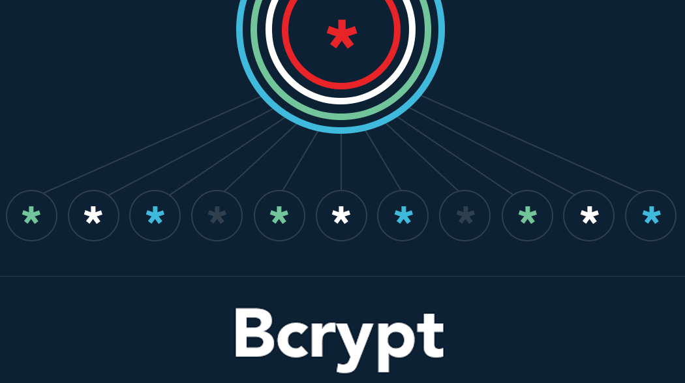
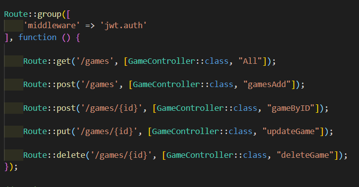
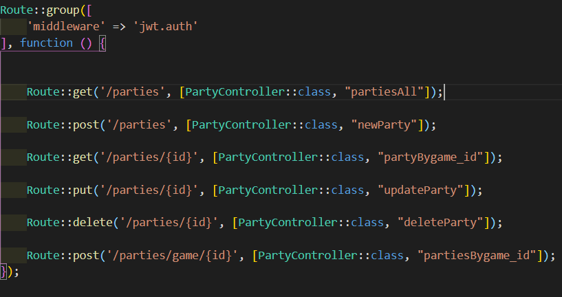
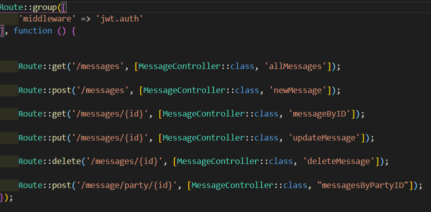

# Proyecto Laravel_PHP

## Instrucciones 

<ol>
    <li>Se requiere tener "composer" instalado en el sistema para poder instalar las dependencias.</li>
    <li>Para instalar de manera local se debe ejecutar el comando php composer install.</li>
    <li>Para usar en una base de datos propia, se debe de cambiar el nombre del archivo .env.example a .env y agregar los datos de la base de datos a utilizar.</li>
    <li>Luego se deberá realizar las migraciones de las tablas con el comando php artisan migrate.</li>
</ol>

## Tecnologias utilizadas.

     

## Endpoints.

### users.

 
 
### Games.

### Parties.

### messages.

(<a href="#top">Volver al inicio</a>)

 
 

